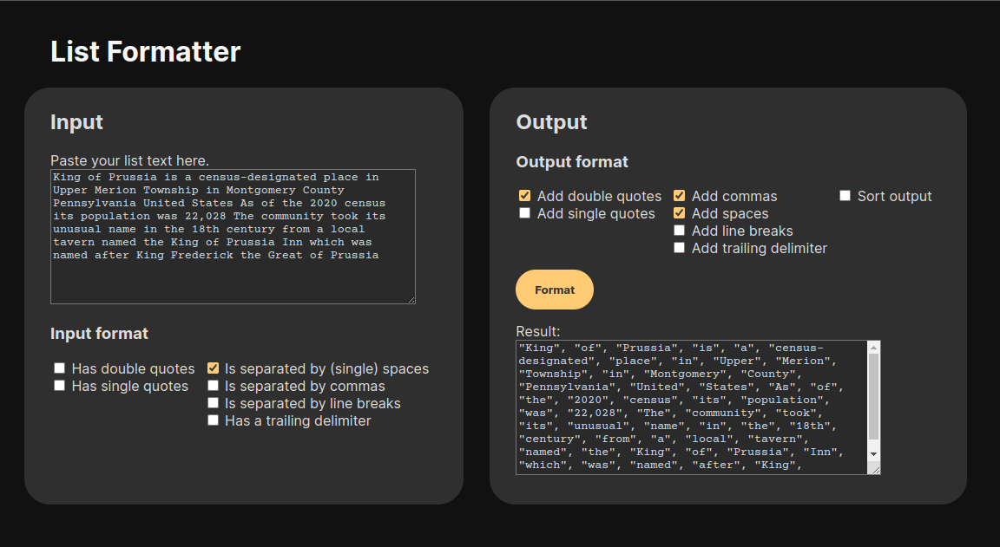

# List formatter

Created: 2023 August 18

Author: Zachary Liou

[Try it here!](http://zachliou.com/formatter)

This is a tool to help re-format a list of strings with to have quotes, commas,
and other delimiters.

This project was made as a way to learn and explore WebAssembly with C++
(using Emscripten). Check out `LEARNING_NOTES.md` for some lessons learned!


## Instructions

To compile the formatter with Emscripten and Lembind:
```
emcc -lembind formatter.cc -o formatter.js
```

Run a local HTTP server:

```
python3 -m http.server
```

Navigate to:

```
http://0.0.0.0:8000/
```

To view C++ changes, recompile `formatter.cc` and refresh the page.

To view JS, HTML, and CSS changes, simply refresh the page.


## Testing

First, compile `formatter_lib_test.cc`.
```
g++ formatter_lib_test.cc -o formatter_lib_test.out
```

Then, run the executable to test.
```
./formatter_lib_test.out
```



